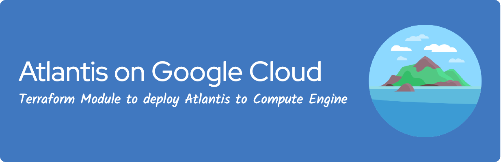

# Atlantis on Google Compute Engine



This Terraform module deploys various resources to run Atlantis on Google Compute Engine.

- [Feature highlights](#feature-highlights)
- [Prerequisites](#prerequisites)
- [Example Usage](#example-usage)
  - [Basic](examples/basic)
  - [Complete](examples/complete)
  - [Cloud Armor](examples/cloud-armor)
  - [Secured Environment Variables](examples/secure-env-vars)
- [How to deploy](#how-to-deploy)
  - [Important](#important)
  - [After it's successfully deployed](#after-its-successfully-deployed)
- [Configuring Atlantis](#configuring-atlantis)
  - [Setting sensitive environment variables](#setting-sensitive-environment-variables)
- [Service Account](#service-account)
  - [Permissions](#permissions)
- [DNS Record](#dns-record)
  - [Example](#example)
- [Identity-Aware Proxy](#identity-aware-proxy)
  - [Enabling IAP](#enabling-iap)
  - [What's exactly protected?](#whats-exactly-protected)
  - [Permissions](#permissions)
- [FAQ](#faq)
- [Requirements](#requirements)

## Feature highlights

- **Container-Optimized OS** - Atlantis runs as a Docker container on a container optimized VM.

- **Managed Instance Group** - The VM instance is part of a MIG (Managed Instance Group), this ensures that Atlantis is always up and running.

- **External HTTPS Load Balancer** - A Layer 7 load balancer is created together with a managed SSL certificate for the provided domain.

- **Identity-Aware Proxy** - The Atlantis UI can be protected by Google Cloud Identity-Aware Proxy, this adds an additional layer of security by requiring users to authenticate with their Google account.

- **Custom port for Atlantis** - This module features the ability to run Atlantis on a custom port, simply set the `ATLANTIS_PORT` environment variable.

- **Separate Persistent Data Disk** - The VM instance has a separate attached persistent data disk attached to it to ensure that Atlantis data is persisted and not lost if the VM is deleted or terminated.

- **Shielded VM** - A Shielded VM is a VM that's hardened by a set of security controls that help defend against rootkits and bootkits. Using a Shielded VM helps protect enterprise workloads from threats like remote attacks, privilege escalation, and malicious insiders.

- **Cloud Armor** - Use Google Cloud Armor security policies to protect the default backend service from distributed denial-of-service (DDoS) and other web-based attacks. Security policies can be configured manually, with configurable match conditions and actions in a security policy. Google Cloud Armor also features preconfigured security policies, which cover a variety of use cases.

- **Confidential VM** - A Confidential VM is a type of Compute Engine VM that ensures that your data and applications stay private and encrypted even while in use. You can use a Confidential VM as part of your security strategy so you do not expose sensitive data or workloads during processing. Note that Confidential VM [does not support live migration](https://cloud.google.com/confidential-computing/confidential-vm/docs/error-messages#live_migration_isnt_supported), so if this feature is enabled, `onHostMaintenance` will be set to `TERMINATE`.

## Prerequisites

This module expects that you already own or create the below resources yourself.

- Google network, subnetwork and a Cloud NAT
- Service account
- Domain

If you prefer an example that includes the above resources, see [`complete example`](https://github.com/runatlantis/terraform-gce-atlantis/tree/master/examples/complete).

## Example Usage

Here are some examples to choose from. Look at the prerequisites above to find one that is appropriate for your configuration.

- [Basic](https://github.com/runatlantis/terraform-gce-atlantis/tree/master/examples/basic)
- [Complete](https://github.com/runatlantis/terraform-gce-atlantis/tree/master/examples/complete)
- [Secure Environment Variables](https://github.com/runatlantis/terraform-gce-atlantis/tree/master/examples/secure-env-vars)
- [Cloud Armor](https://github.com/runatlantis/terraform-gce-atlantis/tree/master/examples/cloud-armor)
- [Shared VPC](https://github.com/runatlantis/terraform-gce-atlantis/tree/master/examples/shared-vpc)

```hcl
module "atlantis" {
  source  = "runatlantis/atlantis/gce"
  # insert the 7 required variables here
}
```

## How to deploy

See [`main.tf`](https://github.com/runatlantis/terraform-gce-atlantis/tree/master/examples/basic/main.tf) and the [`server-atlantis.yaml`](https://github.com/runatlantis/terraform-gce-atlantis/tree/master/examples/basic/server-atlantis.yaml).

### Important

- Provisioning the Google Cloud Managed SSL certificate can take up to 25 minutes after the `terraform apply` has finished.

- If you bring your own Docker image (*not using any Atlantis image as base image*), be sure to create an Atlantis user using a uid (user ID) of 100.

### After it's successfully deployed

Once you're done, see [Configuring Webhooks for Atlantis](https://www.runatlantis.io/docs/configuring-webhooks.html#configuring-webhooks)

## Configuring Atlantis

Atlantis offers the ability to configure everything through environment variables.

The module exposes a variable: `var.env_vars` where you can pass any environment variable you want.

```hcl
env_vars = {
  ATLANTIS_EXAMPLE = "example"
}
```

For an overview of all possible environment variables, see: [Atlantis Server Configuration](https://www.runatlantis.io/docs/server-configuration.html#flags)

### Setting sensitive environment variables

See [secured environment variables](https://github.com/runatlantis/terraform-gce-atlantis/tree/master/examples/secure-env-vars) for an example on how to deal with sensitive values in environment variables.

## Service Account

As Google recommends custom service accounts and permissions granted via IAM Roles. We advice that you bring your own service account.

Note that you must grant the relevant permissions to your service account yourself, e.g. Storage related permissions for the Terraform state bucket and other permissions in order to create resources through Terraform.

### Permissions

The `roles/logging.logWriter` & `roles/monitoring.metricWriter` roles should be attached to the service account in order to write logs to Cloud Logging and ingest metric data into Cloud Monitoring.

See [`main.tf`](https://github.com/runatlantis/terraform-gce-atlantis/blob/main/examples/basic/main.tf#L16-L33)

## DNS Record

This example uses Cloud DNS to add an A record containing the load balancer IP address. If you don't use Cloud DNS, please add the A record using the load balancer IP address on the platform where you've registered your domain.

It's a requirement to add the A record to the domain record set in order to sucessfully provision the certificate!

### Example

If you use Cloud DNS and own a managed zone for your domain, use the IP address that's part of the module output to create the A record.

See [`main.tf`](https://github.com/runatlantis/terraform-gce-atlantis/blob/main/examples/basic/main.tf#L60-L71)

## Identity-Aware Proxy

Google Cloud's Identity-Aware Proxy (IAP) is a service that can be used to secure the Atlantis UI by authenticating users with Google Accounts

### Enabling IAP

To enable IAP, you will need to configure the OAuth Consent Screen and create OAuth credentials, as described in the [Enabling IAP](https://cloud.google.com/iap/docs/enabling-compute-howto#enabling_iap_console) guide.

Once you have the OAuth credentials, you can set the `iap` variable to use them.

```hcl
iap = {
  oauth2_client_id     = data.google_secret_manager_secret_version.atlantis_client_id.secret_data
  oauth2_client_secret = data.google_secret_manager_secret_version.atlantis_client_secret.secret_data
}
```

### What's exactly protected?

With IAP enabled, all requests to Atlantis will be protected, except for those made to the `/events` path, which is used for webhooks between platforms such as GitHub and BitBucket.

### Permissions

To grant a user access to your IAP-protected Atlantis deployment, you will need to give them the `roles/iap.httpsResourceAccessor` role.

```hcl
resource "google_iap_web_iam_member" "member" {
  project = "<your-project-id>"
  role = "roles/iap.httpsResourceAccessor"
  member = "user:jane@example.com"
}
```

## FAQ

### When sending an HTTP request, I'm receiving an ERR_EMPTY_RESPONSE error

We expect you to use HTTPS because we are not routing or redirecting any HTTP requests.

### My VM experienced an outage and is taking some time to restart

It may take up to three minutes for the Managed Instance Group to safely shut down and recreate the VM before it is considered healthy again.

### Even though terraform apply worked correctly, I'm receiving an ERR_SSL_VERSION_OR_CIPHER_MISMATCH error

This error indicates that the Google Cloud Managed SSL certificate is not yet fully provisioned.
If all configurations are correct, it may take up to 25 minutes for the certificate to be provisioned.
You can check the status of the certificate in the Google Cloud Console.


<!-- BEGIN_TF_DOCS -->
## Requirements

No requirements.

## Providers

No providers.

## Modules

No modules.

## Resources

No resources.

## Inputs

No inputs.

## Outputs

No outputs.
<!-- END_TF_DOCS -->